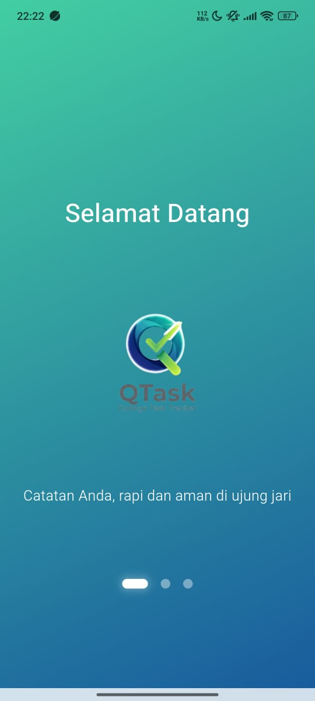
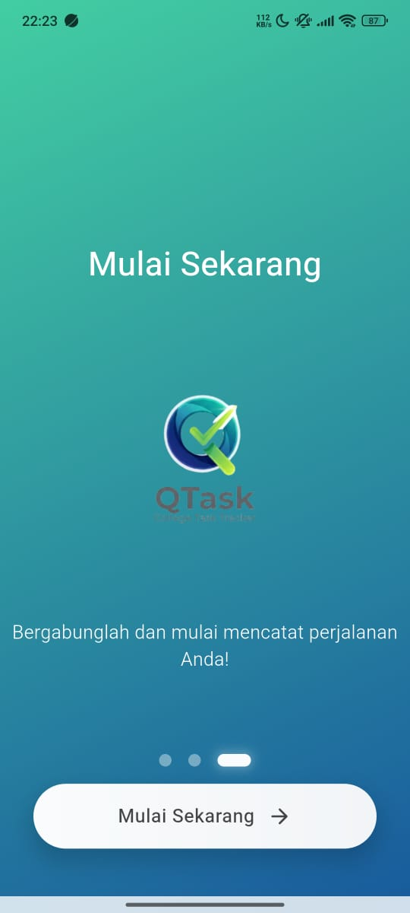
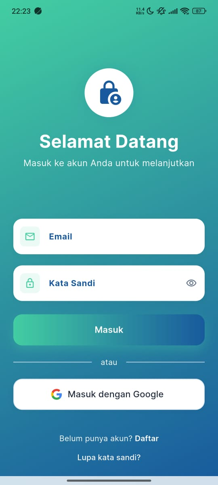
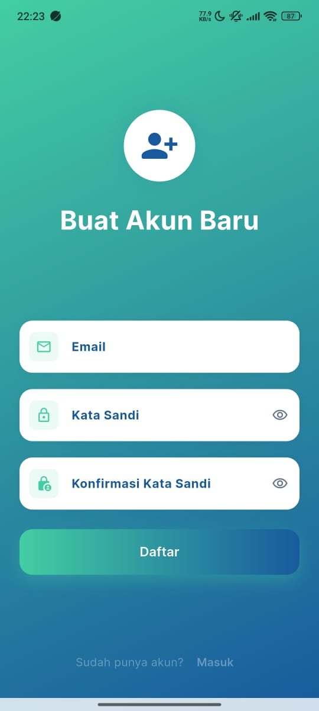
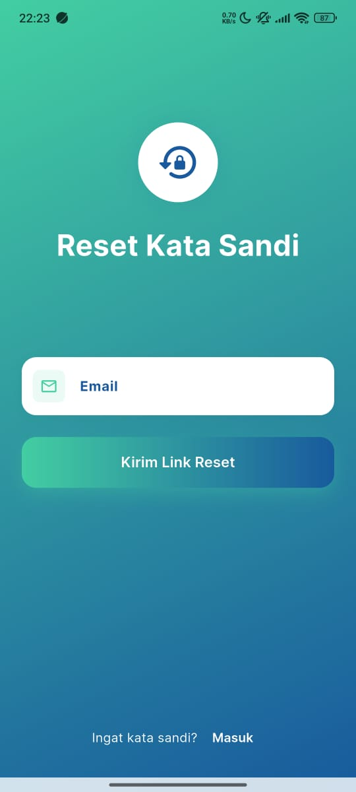
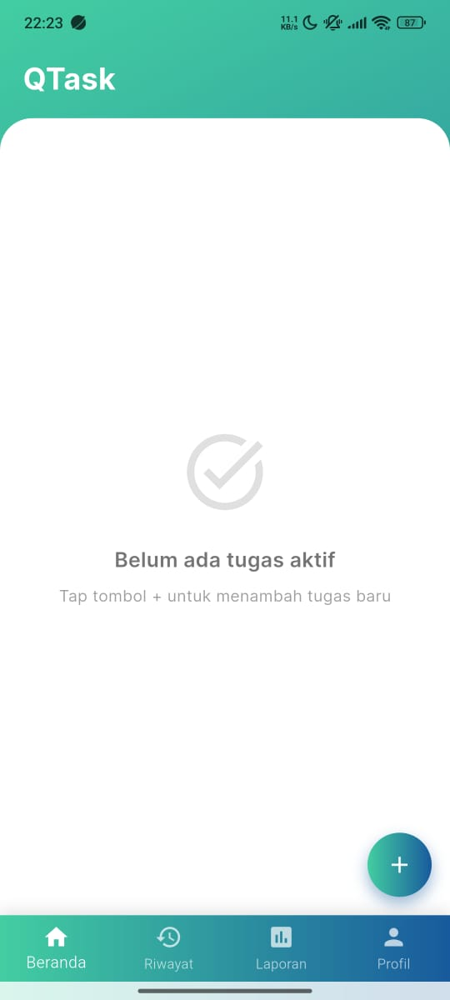
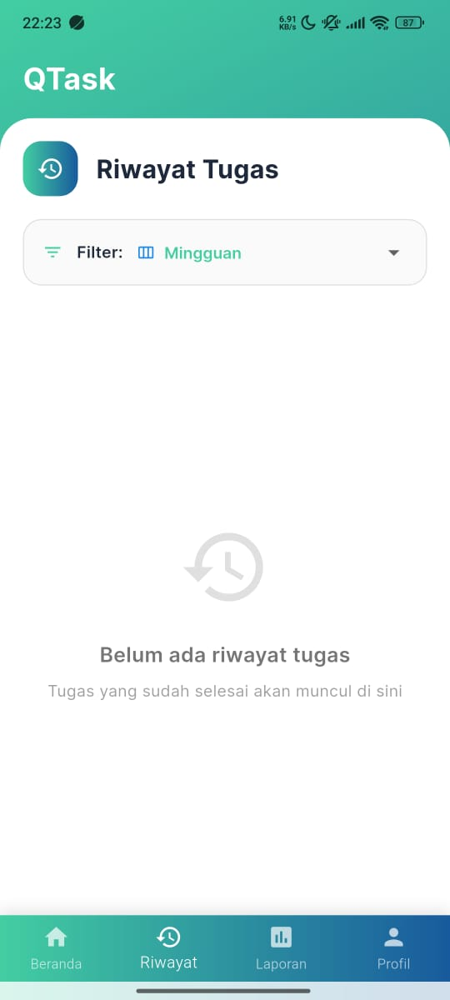
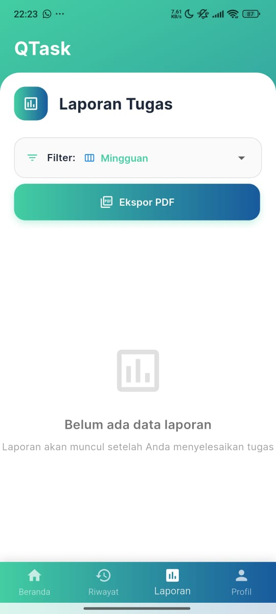
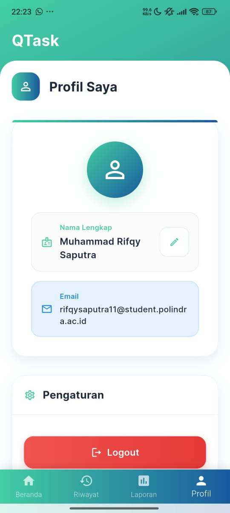

# QTASK - Manajemen Tugas Kuliah

Note adalah aplikasi Flutter untuk membantu mahasiswa mengelola tugas kuliah, mencatat, memantau progres, dan menghasilkan laporan PDF. Aplikasi ini terintegrasi dengan Firebase untuk autentikasi dan penyimpanan data.

## Contoh Gambar

<div style="display: flex; flex-wrap: wrap; gap: 10px;">
  
  
  
  
  
  
  
  
  
</div>

## Fitur Utama

- **Autentikasi Aman**: Login, registrasi, dan reset password menggunakan Firebase Auth.
- **Manajemen Tugas**: Tambah, edit, hapus, dan tandai tugas sebagai selesai.
- **Riwayat Tugas**: Lihat riwayat tugas yang sudah diselesaikan.
- **Laporan Tugas**: Filter laporan mingguan, bulanan, tahunan, dan ekspor ke PDF.
- **Custom Branding**: Logo dan ikon aplikasi dapat diganti sesuai kebutuhan.
- **Notifikasi & Alert**: Feedback jelas untuk setiap aksi, termasuk validasi email dan error handling.
- **UI Modern**: Desain responsif, animasi, dan dukungan Google Fonts.
- **Share PDF**: Bagikan laporan tugas dalam format PDF langsung dari aplikasi.
- **Pencarian Tugas**: Cari tugas berdasarkan nama atau deskripsi.
- **Filter & Sortir**: Filter tugas berdasarkan status, tanggal, dan urutan.
- **Splash Screen**: Tampilan pembuka aplikasi yang menarik.
- **Profil Pengguna**: Lihat dan edit data profil pengguna.
- **Dukungan Multi-Platform**: Bisa dijalankan di Android, iOS, Web, dan Desktop.
- **Keamanan Data**: Data tersimpan di cloud dan hanya bisa diakses oleh user terkait.
- **Validasi Form**: Input form yang aman dan terkontrol.
- **Integrasi Share Plus**: Bagikan data ke aplikasi lain dengan mudah.

## Instalasi

1. Pastikan sudah menginstal [Flutter](https://flutter.dev/docs/get-started/install) dan [Dart](https://dart.dev/get-dart).
2. Clone repository ini:
   ```bash
   git clone https://github.com/username/note.git
   cd note
   ```
3. Install dependencies:
   ```bash
   flutter pub get
   ```
4. Konfigurasi Firebase:
   - Buat project di [Firebase Console](https://console.firebase.google.com/).
   - Tambahkan file `google-services.json` ke folder `android/app` dan `GoogleService-Info.plist` ke folder `ios/Runner`.
   - Pastikan konfigurasi Firebase sudah sesuai dengan dokumentasi FlutterFire.
5. Jalankan aplikasi:
   ```bash
   flutter run
   ```

## Build APK

Untuk membuat APK release:

```bash
flutter build apk --release
```

File APK akan tersedia di `build/app/outputs/flutter-apk/app-release.apk`.

## Struktur Folder

- `lib/` - Source code utama aplikasi
  - `auth/` - Layar login, registrasi, reset password
  - `screen/` - Dashboard, laporan, riwayat, dll
  - `utils/` - Helper dan komponen umum
- `assets/` - Gambar dan ikon aplikasi
- `android/`, `ios/`, `web/`, `linux/`, `macos/`, `windows/` - Platform target

## Teknologi

- Flutter
- Riverpod (state management)
- Firebase Auth & Firestore
- Google Fonts
- flutter_animate
- intl
- share_plus
- pdf

## Kontribusi

Kontribusi terbuka untuk perbaikan bug, penambahan fitur, dan peningkatan UI/UX. Silakan buat pull request atau issue di repository.

## Lisensi

MIT License
